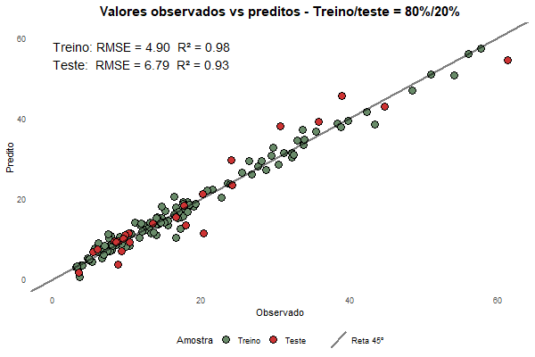

<style type="text/css">
body, td {
  font-size: 16px;
}
code.r{
  font-size: 14px;
}
pre {
  font-size: 14px
}
</style>

```{r Configurações globais, include=FALSE}
options(tinytex.verbose=TRUE)
knitr::opts_chunk$set(fig.align='center', results='asis', ft.align='center')
```

## **1) Pacotes**
Inicialmente, os pacotes necessários para a execução do script são instalados (se necessário) e carregados ao ambiente.

```{r Pacotes, results=FALSE, message=FALSE, warning=FALSE}
pacotes <- c(
  'tidyverse',  # pacotes ggplot2, dplyr, stringr, purrr, forcats, readxl
  'magrittr',   # pipelines %>% , %<>%
  'flextable',  # funções para visualização em tabelas
  'cleaner',    # função freq()
  'Hmisc',      # função rcorr()
  'reshape2',   # função melt()
  'caret',      # funções para validação cruzada e grid-search
  'neuralnet',  # função neuralnet() para gerar a rede neural
  'iml')        # funções para interpretação de modelos supervisionados

instalado <- pacotes %in% installed.packages()
if (FALSE %in% instalado) install.packages(pkgs=pacotes[!instalado], 
                                           dependencies=T)
sapply(pacotes, require, character.only=T)
```

```{r include=FALSE}
rm(pacotes, instalado)
```

## **2) Banco de dados**
Os dados deste trabalho se referem a:

* características de corpos-de-prova constituídos de concreto armado e submetidos a cargas;
* medições de deformação vertical dos corpos-de-prova após determinado período de tempo.

### **2.1) Importação do banco de dados**
O banco de dados utilizado neste trabalho se encontra no artigo *Bernard, E. Long term sustained loading tests on reinforced concrete beams. Université Libre de Bruxelles, 1988*. O arquivo contendo o banco de dados se encontra para importação no formato .xlsx.

```{r Importação dos dados}
# Importação dos dados
dados <- readxl::read_excel('Dados.xlsx') %>% 
  column_to_rownames(var='ID') %>% as.data.frame()

# Variáveis do banco de dados
message('Variáveis do banco de dados:')
print(paste(colnames(dados), collapse=' | '))
```

### **2.2) Descrição das variáveis**
A seguir, são descritas as variáveis obtidas do banco de dados.

* **Altura** (cm): Altura da seção bruta do corpo-de-prova.
* **Largura** (cm): Largura da seção bruta do corpo-de-prova.
* **Comprimento** (m): Comprimento do corpo-de-prova.
* **Resistência do concreto no Tempo j** (MPa): Resistência característica do concreto à compressão.
* **Tempo j** (MPa): Idade do corpo-de-prova no momento da medição da resistência do concreto.
* **Barra**: Tipo de superfície da barra de aço (barra lisa ou barra nervurada).
* **Momento fletor** (kN.m): Máximo esforço de momento fletor teórico (calculado na metade do comprimento do corpo-de-prova), devido ao peso-próprio do elemento e pela aplicação de carga.
* **Armação positiva** (cm²): Área de aço localizada na parte inferior do corpo-de-prova.
* **D. Armação positiva** (cm): Distância entre o centroide da armação positiva e a superfície inferior do corpo-de-prova.
* **Armação negativa** (cm²): Área de aço localizada na parte superior do corpo-de-prova.
* **D. Armação negativa** (cm): Distância entre o centroide da armação negativa e a superfície superior do corpo-de-prova.
* **Tempo inicial** (dias): Idade do corpo-de-prova no momento em que o elemento é submetido a esforço de momento fletor e ocorre a medição inicial do deslocamento vertical instantâneo do corpo-de-prova.
* **Deslocamento inicial** (mm): Deslocamento vertical do corpo-de-prova medido no "Tempo inicial".
* **Tempo final** (dias): Idade do corpo-de-prova no momento da medição final do deslocamento vertical do corpo-de-prova.
* **Deslocamento final** (mm): Deslocamento vertical do corpo-de-prova medido no "Tempo final".

### **2.3) Unidade de medida das variáveis**
Para melhor compreensão dos dados, a unidade de medida de algumas variáveis foram alteradas (por exemplo, de milímetro para metro).

```{r Ajustes das escalas dos dados}
# Ajuste das escalas de medida das variáveis
dados %<>% dplyr::mutate(
  Altura = Altura %>% magrittr::divide_by(10), # mm -> cm
  Largura = Largura %>% magrittr::divide_by(10), # mm -> cm
  Comprimento = Comprimento %>% magrittr::divide_by(10^3), # mm -> m
  `Momento fletor` = 
    `Momento fletor` %>% magrittr::divide_by(10^3), # N.m -> kN.m   
  `Armação positiva` = 
    `Armação positiva` %>% magrittr::divide_by(10^2), # mm² -> cm²
  `D. Armação positiva` = 
    `D. Armação positiva` %>% magrittr::divide_by(10), # mm -> cm
  `Armação negativa` =
    `Armação negativa` %>% magrittr::divide_by(10^2), # mm² -> cm²
  `D. Armação negativa` = 
    `D. Armação negativa` %>% magrittr::divide_by(10)) # mm -> cm
```

### **2.4) Considerações iniciais**
I) Variável resposta da amostra: "Deslocamento final".

```{r Variável resposta}
var_resp <- 'Deslocamento final'
```

II) A resistência do concreto dos corpos-de-prova, no momento do início da aplicação de carga, deve ser conhecida. Portanto, serão desconsideradas as observações cujas medidas da resistência do concreto ocorreram após o início do carregamento do corpo-de-prova.

No banco de dados importado, o tempo em que ocorreu a medição da resistência do concreto é denotado por "Tempo j" e o tempo de início da aplicação de carga ao corpo-de-prova é detonado por "Tempo inicial".

```{r Ajustes iniciais no banco de dados - 1}
N <- nrow(dados)
dados %<>% dplyr::filter(`Tempo j`<=`Tempo inicial`)
sprintf('Observações removidas: %i', N-nrow(dados))
```

III) O tempo em que ocorreu a medição da resistência do concreto dos corpos-de-prova é desconsiderado em termos práticos, desde que esse tempo seja igual ou inferior ao tempo de início da aplicação de carga ao corpo-de-prova. Portanto, o aumento de resistência do concreto, ao longo do tempo, é desprezado.

Adicionalmente, para fins de simplificação, a variável "Resistência do concreto no Tempo j" é renomeada para "Concreto".

```{r Ajustes iniciais no banco de dados - 2}
dados %<>% dplyr::select(-'Tempo j')
dados %<>% dplyr::rename(Concreto='Resistência do concreto no Tempo j')
```

IV) O banco de dados importado possui duas variáveis respostas em tempos distintos: o "Deslocamento inicial" no "Tempo inicial" e o "Deslocamento final" no "Tempo final". Na metodologia convencional, para estimação de deformações a longo prazo, o deslocamento inicial é estimado e utilizado como uma etapa intermediária para o cálculo do deslocamento após determinado período de tempo. Como o modelo de regressão permite a predição apenas de uma variável resposta, a variável "Deslocamento inicial" é desconsiderada.

```{r Ajustes iniciais no banco de dados - 3}
dados %<>% dplyr::select(-'Deslocamento inicial')
```

V) A variável "Tempo inicial" é subtraída da variável "Tempo final", de modo a gerar a variável "Tempo sob carga". Por conseguinte, as variáveis "Tempo inicial" e "Tempo final" tornam-se irrelevantes e são desconsideradas.

```{r Ajustes iniciais no banco de dados - 4}
dados %<>% dplyr::mutate(`Tempo sob carga` = `Tempo final` - `Tempo inicial`)
dados %<>% dplyr::relocate(`Tempo sob carga`, .before=`Deslocamento final`)
dados %<>% dplyr::select(-'Tempo inicial', -'Tempo final')

# Variáveis do banco de dados
message('Variáveis do banco de dados:')
print(paste(colnames(dados), collapse=' | '))
```

## **3) Exploração dos dados**

### **3.1) Visualização do banco de dados**
Visualização de 6 observações aleatórias do banco de dados.

```{r Função para visualização de tabelas}
# Função para visualização de dataframe em formato de tabela
flextable::init_flextable_defaults()
flextable::set_flextable_defaults(theme_fun='theme_box', border.color='gray55',
                                  big.mark='', digits=2, na_str='-')
visualiza <- function(data, titulo=NULL){
  data %>% flextable::flextable() %>% flextable::colformat_double() %>% 
    flextable::colformat_int() %>% flextable::bg(bg='gray85', part='header') %>%
    flextable::align(align='center', part='all') %>% {if (!is.null(titulo))
      flextable::set_caption(., as_paragraph(as_b(titulo))) else .}
}
```

```{r Visualização dos dados}
# Visualização dos dados
dados[seq(from=1, to=nrow(dados), length.out=6), 1:6] %>% 
  rownames_to_column('ID') %>% visualiza(
    titulo='Banco de dados - Amostra de 6 observações (Parte 1)') %>% 
  flextable::colformat_double(digits=1) %>% 
  flextable::width(j=1, width=0.1) %>% 
  flextable::add_header_row(values = c('-', '(cm)', '(cm)', '(m)', '(MPa)',
                                       '-', '(kN.m)'), top=F)

dados[seq(from=1, to=nrow(dados), length.out=6), 7:ncol(dados)] %>% 
  rownames_to_column('ID') %>% visualiza(
    titulo='Banco de dados - Amostra de 6 observações (Parte 2)') %>%
  flextable::colformat_double(digits=1) %>% 
  flextable::width(j=1, width=0.1) %>% 
  flextable::width(j=c(3,5,6), width=1) %>% 
  flextable::add_header_row(values = c('-', '(cm²)', '(cm)', '(cm²)', '(cm)', 
                                       '(dias)', '(mm)'), top=F)
```

### **3.2) Estrutura do banco de dados**
As variáveis do banco de dados são do tipo "inteira", "numérica" ou "texto".

```{r Tipos das variáveis}
tipos_variaveis <- function(data) return(
  data %>% purrr::map_vec(typeof) %>% data.frame() %>% rownames_to_column())

# Ajuste dos tipos das variáveis
dados %<>% dplyr::mutate(`Tempo sob carga`=`Tempo sob carga` %>% as.integer())

bind_cols(tipos_variaveis(dados[,1:6]) %>% dplyr::rename(Var1=1, Tipo1=2),
          tipos_variaveis(dados[,7:ncol(dados)]) %>% 
            dplyr::rename(Var2=1, Tipo2=2)) %>% 
  visualiza(titulo='Banco de dados - Tipos das variáveis') %>% 
  flextable::set_header_labels(Var1='Variável', Tipo1='Tipo',
                               Var2='Variável', Tipo2='Tipo') %>% 
  flextable::bold(j=c('Tipo1', 'Tipo2')) %>% 
  flextable::color(j=c('Tipo1', 'Tipo2'), color='brown3') %>% 
  flextable::color(i= ~Tipo1=='character', j=c('Tipo1'), color='seagreen') %>% 
  flextable::color(i= ~Tipo2=='character', j=c('Tipo2'), color='seagreen') %>% 
  flextable::color(i= ~Tipo1=='integer', j=c('Tipo1'), color='royalblue2') %>% 
  flextable::color(i= ~Tipo2=='integer', j=c('Tipo2'), color='royalblue2')
```

### **3.3) Verificação de observações repetidas**
Não há observações repetidas no banco de dados.

```{r Observações repetidas}
sprintf('Observações repetidas: %i', sum(duplicated(dados)))
```

### **3.4) Verificação de dados faltantes**
Nota-se que há dados faltantes referentes à armação negativa dos corpos-de-prova.

```{r Dados faltantes}
dados_faltantes <- function(data) return(
  data %>% purrr::map_vec(~sum(is.na(.))) %>% data.frame() %>% 
    rownames_to_column())

bind_cols(dados_faltantes(dados[,1:6]) %>% dplyr::rename(Var1=1, Falt1=2),
          dados_faltantes(dados[,7:ncol(dados)]) %>% 
            dplyr::rename(Var2=1, Falt2=2)) %>% 
  visualiza(titulo='Banco de dados - Dados faltantes') %>% 
  flextable::color(i= ~Falt1 !=0, j='Falt1', color='red') %>% 
  flextable::bold(i= ~Falt1 !=0, j='Falt1') %>% 
  flextable::color(i= ~Falt2 !=0, j='Falt2', color='red') %>%
  flextable::bold(i= ~Falt2 !=0, j='Falt2') %>% 
  flextable::set_header_labels(Var1='Variável', Falt1='Dados faltantes',
                               Var2='Variável', Falt2='Dados faltantes')
```

Neste caso, pode-se considerar os valores faltantes como iguais a zero. Em relação às demais variáveis, não há dados faltantes. Portanto, não é necessário realizar imputação de dados ou remoção de observação por esse motivo.

```{r Dados faltantes após ajustes}
dados %<>% dplyr::mutate(across(c('Armação negativa', 'D. Armação negativa'), 
                                ~replace(., is.na(.), 0)))

bind_cols(dados_faltantes(dados[,1:6]) %>% dplyr::rename(Var1=1, Falt1=2),
          dados_faltantes(dados[,7:ncol(dados)]) %>% 
            dplyr::rename(Var2=1, Falt2=2)) %>% 
  visualiza(titulo='Banco de dados - Dados faltantes após ajustes') %>% 
  flextable::set_header_labels(Var1='Variável', Falt1='Dados faltantes',
                               Var2='Variável', Falt2='Dados faltantes')
```

### **3.5) Remoção de outliers na variável resposta**
Foram removidas as observações cujos valores das variáveis respostas se apresentam de forma discrepantes em relação aos 1º e 3º quartis.
```{r Detecção dos outliers}
ids_outliers <- dados[, var_resp] %>% 
  which(x = . < quantile(., 0.25)-1.5*IQR(.) | . > quantile(., 0.75)+1.5*IQR(.))
```

Histogramas da variável resposta nas situações anterior e posterior à remoção dos outliers.
```{r Histogramas - Remoção de outliers}
ids_outliers <- dados[, var_resp] %>% 
  which(x = . < quantile(., 0.25)-1.5*IQR(.) | . > quantile(., 0.75)+1.5*IQR(.))

ggplot(data=bind_rows(
  Antes=data.frame(var=dados[, var_resp]),
  Depois=data.frame(var=dados[-ids_outliers, var_resp]), 
  .id='Situação'), aes(x=var, y=after_stat(density))) +
  geom_histogram(bins=25, fill='dodgerblue1', alpha=0.4) + 
  geom_density(color='red', linewidth=1.2) + labs(x=NULL, y=NULL) +
  ggtitle(paste0('Variável resposta - Histogramas\n',
                 'Antes e após a remoção dos outliers')) +
  facet_wrap(~ Situação, scales='free') + theme_bw() +
  theme(plot.title=element_text(size=14, face='bold', hjust=0.5),
        panel.grid.major.x=element_blank(),
        panel.grid.minor.x=element_blank(),
        panel.grid.major.y=element_blank(),
        panel.grid.minor.y=element_blank(),
        axis.text.y=element_blank(),
        axis.ticks.y=element_blank())
```

Boxplots da variável resposta nas situações anterior e posterior à remoção dos outliers.
```{r Boxplots - Remoção de outliers}
ggplot(data=bind_rows(
  Antes=data.frame(var=dados[, var_resp]),
  Depois=data.frame(var=dados[-ids_outliers, var_resp]), 
  .id='Situação'), aes(x=Situação, y=var)) +
  geom_boxplot(show.legend=F, outlier.colour='red', outlier.size=2.5) +
  geom_point() + labs(x=NULL, y=NULL) +
  ggtitle('Variável resposta - Boxplots\nAntes e após a remoção dos outliers') +
  facet_wrap(~ Situação, scales='free') + theme_bw() +
  theme(plot.title=element_text(size=14, face='bold', hjust=0.5),
        panel.grid.major.x=element_blank(),
        panel.grid.major.y=element_blank(),
        panel.grid.minor.y=element_blank(),
        axis.text.x=element_blank(),
        axis.ticks.x=element_blank())
```

```{r Remoção dos outliers}
N <- nrow(dados)
dados <- dados[-ids_outliers,]
sprintf('Observações com outliers removidas: %i', N-nrow(dados))
```

### **3.6) Distribuição das variáveis númericas**
Para a visualização das distribuições das variáveis numéricas, foi realizada a normalização, i.e., as variáveis foram transformadas para a escala de 0 a 1.
A normalização também é empregada na etapa de geração do modelo de rede neural, com o fim de otimizar o processo de cálculo dos pesos da rede devido à redução da escala dos erros utilizados para a convergência do método do gradiente descendente.

```{r Normalização dos dados}
# Dataframe contendo apenas as variáveis numéricas
df_num <- dplyr::select_if(dados, is.numeric)

# Normalização dos dados
min <- sapply(df_num, min) ; max <- sapply(df_num, max)
df_num %<>% scale(center=min, scale=max-min) %>% as.data.frame()
```

Histogramas das variáveis numéricas.
```{r Histogramas - Variáveis numéricas, message=FALSE}
ggplot(reshape2::melt(df_num), aes(x=value, y=after_stat(density))) +
  geom_histogram(bins=10, fill='dodgerblue1', alpha=0.4) + 
  geom_density(color='red', linewidth=1.2) + labs(x=NULL, y=NULL) +
  ggtitle('Variáveis numéricas - Histogramas') +
  facet_wrap(~ variable, scales='free') + theme_bw() +
  theme(plot.title=element_text(size=14, face='bold', hjust=0.5),
        panel.grid.major.x=element_blank(),
        panel.grid.minor.x=element_blank(),
        panel.grid.major.y=element_blank(),
        panel.grid.minor.y=element_blank(),
        axis.text.y=element_blank(),
        axis.ticks.y=element_blank())
```

Boxplots das variáveis numéricas.
```{r Boxplots - Variáveis numéricas, message=FALSE}
ggplot(reshape2::melt(df_num), aes(x=variable, y=value)) +
  geom_boxplot(aes(fill=variable), show.legend=F, 
               outlier.colour='red', outlier.size=2.5) + geom_point() +
  ggtitle('Variáveis numéricas - Boxplots') +
  labs(x=NULL, y=NULL) + theme_minimal() +
  theme(plot.title=element_text(size=14, face='bold', hjust=0.5),
        axis.text.x=element_text(angle=25, vjust=1.1),
        panel.grid.major.x=element_blank(),
        panel.grid.major.y=element_blank(),
        panel.grid.minor.y=element_blank(),
        axis.ticks.x=element_blank()) +
  scale_x_discrete(labels = function(x) stringr::str_wrap(x, width=10))
```

Há a presença de “outliers” nas variáveis numéricas. Entretanto, devido à baixa quantidade de observações do banco de dados, os outliers remanescentes foram mantidos.

### **3.7) Estatísticas descritivas das variáveis**

#### i) Medidas das variáveis númericas

```{r Medidas}
# Dataframe contendo apenas as variáveis numéricas
df_num <- dplyr::select_if(dados, is.numeric)

# Função que calcula medidas de variáveis numéricas
medidas <- function(data) return(
  rbind(sapply(data, summary), sapply(data, sd)) %>% t() %>% as.data.frame() %>%  
  bind_cols(Unidade = c('cm', 'cm', 'm', 'MPa', 'kN.m', 'cm²', 'cm', 'cm²',
                        'cm', 'dias', 'mm'), .) %>% 
  dplyr::rename('Mínimo'=2, '1º Quartil'=3, 'Mediana'=4, 'Média'=5,
                '3º Quartil'=6, 'Máximo'=7, 'Desvio padrão'=8))

medidas(df_num) %>% rownames_to_column('Variável') %>% 
  visualiza(titulo='Variáveis númericas - Medidas de posição e dispersão') %>% 
  flextable::colformat_double(digits=1) %>% 
  flextable::colformat_double(i=c(10), digits=0) 
```

#### ii) Tabela de frequências da variável categórica

A variável categórica possui apenas 2 categorias.

```{r Tabela de frequência, reference-tab}
dados$Barra %>% {bind_cols(
  Categoria = cleaner::freq(.)$item, 
  Quantidade = cleaner::freq(.)$count, 
  Frequência = cleaner::freq(.)$percent %>% 
    magrittr::multiply_by(100) %>% round() %>% paste0('%'))} %>% 
  visualiza(titulo='Frequências da variável "Barra"')
```

### **3.8) Correlações**
As correlações estatisticamente significantes (ao nível de confiança de 95%), entre as variáveis numéricas, são mostradas no "mapa de calor" abaixo.
```{r Mapa de calor}
# Cálculo das correlações e significâncias estatísticas
correlacoes <- Hmisc::rcorr(as.matrix(df_num), type='pearson')$r 
p.valores <- Hmisc::rcorr(as.matrix(df_num), type='pearson')$P 
p.valores[lower.tri(p.valores)] <- NA
correlacoes %<>% reshape2::melt()
p.valores %<>% reshape2::melt()
 
correlacoes %<>% dplyr::left_join(p.valores, by=c('Var1','Var2')) %>% 
  dplyr::rename(Correlação=3, p.valor=4)
correlacoes %<>% mutate(
  Correlação=ifelse(p.valor>0.05 | is.na(p.valor), 0, Correlação) %>% round(2),
  Label=ifelse(p.valor>0.05 | is.na(p.valor), '', Correlação))

# Mapa de calor (heatmap) das correlações entre as variáveis
ggplot(data=correlacoes, aes(
  x=Var1, y=forcats::fct_rev(Var2), fill=Correlação, label=Label)) + 
  geom_tile(colour='gray') + geom_text(size=3.5) + 
  scale_fill_gradient2(low='dodgerblue2', mid='white', high='firebrick2',
                       midpoint=0, limits=c(-1,1)) +
  ggtitle(paste0('Variáveis numéricas - Correlações')) +
  labs(x=NULL, y=NULL, fill='Correlação') + theme_minimal() +
  theme(plot.title=element_text(size=14, face='bold', hjust=0.5),
        axis.text.x=element_text(angle=35, vjust=0.7)) + 
  scale_x_discrete(labels = function(x) stringr::str_wrap(x, width=10))
```

As correlações mais elevadas (consideradas acima de 70%) são mostradas na tabela abaixo, a qual destaca que a variável "Comprimento" possui a maior correlação com a variável resposta.
```{r}
corr <- function(data){
  pares <- combn(x=colnames(data), m=2) %>% t() %>% as.data.frame()
  correlacoes <- tibble()
  for (i in 1:nrow(pares)){
    par <- as.character(pares[i,])
    correlacoes <- tibble(
      'Variável 1' = par[1], 'Variável 2' = par[2],
      'Correlação' = cor.test(data[,par[1]], 
                              data[,par[2]])$estimate %>% round(2),
      'p-valor' = cor.test(data[,par[1]], data[,par[2]])$p.value %>% 
        format(digits=1)) %>% bind_rows(correlacoes)
  } ; return(correlacoes)
}

corr(data=df_num) %>% dplyr::filter(abs(Correlação) > 0.7) %>% 
  dplyr::arrange(desc(abs(Correlação))) %>% 
  visualiza(titulo='Variáveis numéricas - Correlações mais elevadas') %>%
  flextable::bold(i= ~`Variável 1`==var_resp | `Variável 2`==var_resp) %>% 
  flextable::bg(i= ~`Variável 1`==var_resp | `Variável 2`==var_resp, 
                bg='cornsilk') %>% 
  flextable::color(i= ~`Variável 1`==var_resp | `Variável 2`==var_resp, 
                   color='red3') %>% 
  autofit()
```

```{r include=FALSE}
rm(dados_faltantes, tipos_variaveis, medidas, corr)
rm(N, min, max, df_num, ids_outliers, correlacoes, p.valores)
```

## **4) Ajuste dos dados para o modelo**

### **4.1) Variável categória**
Para a utilização do modelo de rede neural, as variáveis *inputs* do modelo devem ser do tipo numérica. Portanto, a variável categórica do banco de dados, a qual indica o tipo de superfície da barra de aço, é transformada em tipo numérico, através da seguinte atribuição: categoria "Lisa" = 0 e categoria "Nervurada" = 1.
```{r Ajuste da variável categórica}
dados %<>% dplyr::mutate(Barra = Barra %>% {ifelse(.=='Nervurada',1,0)})
```

### **4.2) Amostras de treino e teste**
Para a geração e teste do modelo de rede neural, o banco de dados é repartido aleatoriamente em dois tipos de divisões, nas seguintes proporções:

- Divisão 1: 80% para a amostra de treinamento e validação; 20% para a amostra de teste.
- Divisão 2: 70% para a amostra de treinamento e validação; 30% para a amostra de teste.

```{r Divisão em amostras de treino e teste}
# Porcentagens das divisões do banco de dados em amostras de treinamento e teste
divisoes <- c('80%/20%', '70%/30%')

# Objeto que armazenará as amostras de treino para cada divisão
treino <- list()
# Objeto que armazenará as amostras de teste para cada divisão
teste <- list()

set.seed(347) # semente para a reprodução fidedigna do código
for (divisao in divisoes){
  # Porcentagem da amostra de treinamento
  p_treino <- stringr::str_split_i(divisao, pattern='/', i=1) %>%
    stringr::str_remove('%') %>% as.integer()
  # Divisão é realizada dentro de quartis
  ids <- caret::createDataPartition(y=dados[,var_resp], p=p_treino/100, list=F)
  # Seleção aleatórias das observações
  treino[[divisao]] <- dados[ids,]
  teste[[divisao]] <- dados[-ids,]
}
```

As divisões propostas são ilustradas pelo gráfico abaixo.
```{r Gráfico - Divisões das amostras}
ggplot(data=data.frame(
  Amostra=rep(forcats::fct(c('Treino', 'Teste')), 2), 
  Porcentagem=c(80,20, 70,30),
  Divisão=sort(paste('Divisão', rep(1:2, 2)))),
  aes(x=forcats::fct_rev(Divisão), y=Porcentagem, fill=Amostra, 
      group=Amostra, label=paste0(Porcentagem, '%'))) +
  geom_col(position='dodge', width=0.5) + 
  geom_text(hjust=-0.15, size=5, position=position_dodge(width=0.5)) + 
  scale_fill_manual(values=c('forestgreen', 'firebrick3')) +
  ggtitle('Distribuição das amostras de treino e teste') +
  ylim(0, 100) + theme_minimal() + coord_flip() + labs(x=NULL) + 
  theme(axis.text=element_text(size=11),
        plot.title=element_text(size=14, face='bold', hjust=0.5))
```

As distribuições da variável resposta nas amostras de treino e teste se assemelham à distribuição da variável resposta no banco de dados original, conforme os histogramas abaixo.
```{r Histogramas da variável resposta após divisão}
ggplot(data=bind_rows(
  'Amostra de Treino (80%/20%)'=data.frame(var=treino[['80%/20%']][, var_resp]),
  'Amostra de Teste (80%/20%)'=data.frame(var=teste[['80%/20%']][, var_resp]),
  'Amostra de Treino (70%/30%)'=data.frame(var=treino[['70%/30%']][, var_resp]),
  'Amostra de Teste (70%/30%)'=data.frame(var=teste[['70%/30%']][, var_resp]),
  'Banco de dados original'=data.frame(var=dados[, var_resp]), 
  .id='Amostra'), aes(x=var, y=after_stat(density))) +
  geom_histogram(bins=6, fill='dodgerblue1', alpha=0.4) + 
  geom_density(color='red', linewidth=1.2) + labs(x=NULL, y=NULL) +
  ggtitle(paste0('Variável resposta - Histogramas\n',
                 'Divisões nas amostras de treino e teste')) +
  facet_wrap(~ fct(Amostra), scales='free', nrow=2, dir='v') + theme_bw() +
  theme(plot.title=element_text(size=14, face='bold', hjust=0.5),
        panel.grid.major.x=element_blank(),
        panel.grid.minor.x=element_blank(),
        panel.grid.major.y=element_blank(),
        panel.grid.minor.y=element_blank(),
        axis.text.y=element_blank(),
        axis.ticks.y=element_blank())
```

### **4.3) Nomenclatura das variáveis**
O modelo de rede neural, utilizado neste trabalho, não permite que os nomes das variáveis contenham espaços em branco. Portanto, os espaços são substituídos por ".".
```{r Ajuste nos nomes das variáveis}
var_resp <- make.names(var_resp)
for (divisao in divisoes){
  treino[[divisao]] %<>% magrittr::set_colnames(., make.names(colnames(.)))
  teste[[divisao]] %<>% magrittr::set_colnames(., make.names(colnames(.)))
}
message('Variáveis do modelo:')
print(colnames(dados) %>% make.names())
```

## **5) Funções para o modelo de rede neural**

### **5.1) Grid-search (Redes neurais com 1, 2 e 3 camadas ocultas)**
Função que inicia a estrutura da rede neural com apenas 1 camada oculta, com o fim de se obter as "n" melhores quantidades de neurônios com 1 camada oculta. Na sequência, as redes neurais com os melhores desempenhos (menores erros de validação) com 1 camada oculta são ampliadas para 2 camadas ocultas, com o fim de se obter as "n" melhores quantidades de neurônios na 2ª camada oculta. De modo análogo à etapa anterior, as redes neurais com os melhores desempenhos com 2 camadas ocultas são ampliadas para 3 camadas ocultas, com o fim de se obter as "n" melhores quantidades de neurônios na 3ª camada oculta. Esse processo é realizado para todos os tipos de função de ativação especificados.

```{r Função - Grid-search}
rede_gridsearch <- function(data, n_max, n_selecao, K, funcoes){
  # Dataframe que armazenará os resultados dos grid-searches para determinado "K"
  resultados <- data.frame()
  
  # Especificações para a validação cruzada "K-fold"
  especificacoes <- caret::trainControl(
    method='repeatedcv', number=K, repeats=3, search='grid',
    preProcOptions=list(rangeBounds=c(0,1)), verboseIter=F)
  
  # Grid-search: Rede neural com 1 camada oculta
  message('Realizando grid-search: 1 camada oculta e K=', K, '...')
  grid <- expand.grid(layer1=1:n_max, layer2=0, layer3=0)
  for (funcao in funcoes){
    resultados <- rede_fittings(
      data=data, trControl=especificacoes, tuneGrid=grid, act_fct=funcao) %>%
      bind_rows(resultados)
  }

  # Seleção das "n" melhores quantidades de neurônios na 1ª camada oculta
  neuronios <- selecao_camadas(data=resultados, n=n_selecao, funcoes=funcoes)
  message('Quantidades selecionadas de neurônios na 1ª camada oculta:')
  print(neuronios[, c('layer1', 'act_fct')] %>% dplyr::arrange(act_fct, layer1))
  
  # Grid-search: Rede neural com 2 camadas ocultas
  message('Realizando grid-search: 2 camadas ocultas e K=', K, '...')
  for (funcao in funcoes){
    neuronios_funcao <- dplyr::filter(neuronios, act_fct==funcao)
    grid <- data.frame()
    for (i in 1:n_selecao){
      grid <- expand.grid(layer1=neuronios_funcao[i, 'layer1'], 
                          layer2=1:neuronios_funcao[i, 'layer1'], 
                          layer3=0) %>% rbind(grid)
    }
    resultados <- rede_fittings(
      data=data, trControl=especificacoes, tuneGrid=grid, act_fct=funcao) %>%
      bind_rows(resultados)
  }
  
  # Seleção das "n" melhores quantidades de neurônios nas 1ª e 2ª camadas ocultas
  neuronios <- selecao_camadas(data=dplyr::filter(resultados, layer2!=0),
                               n=n_selecao, funcoes=funcoes)
  message('Quantidades selecionadas de neurônios nas 1ª e 2ª camadas ocultas:')
  print(neuronios %>% dplyr::arrange(act_fct, layer1, layer2))
  
  # Grid-search: Rede neural com 3 camadas ocultas
  message('Realizando grid-search: 3 camadas ocultas e K=', K, '...')
  for (funcao in funcoes){
    neuronios_funcao <- dplyr::filter(neuronios, act_fct==funcao)
    grid <- data.frame()
    for (i in 1:n_selecao){
      grid <- expand.grid(layer1=neuronios_funcao[i, 'layer1'], 
                          layer2=neuronios_funcao[i, 'layer2'], 
                          layer3=1:neuronios_funcao[i,'layer2']) %>% rbind(grid)
    }
    resultados <- rede_fittings(
      data=data, trControl=especificacoes, tuneGrid=grid, act_fct=funcao) %>%
      bind_rows(resultados)
  }
  message('Grid-search realizado para K=', K, '.')
  resultados %<>% cbind(K) %>% dplyr::relocate(K, .after=act_fct) %>% 
    dplyr::rename('Camada 1'=layer1, 'Camada 2'=layer2, 
                  'Camada 3'=layer3, 'Função'=act_fct, 'R²'=Rsquared)
  return(resultados) # métricas das redes neurais treinadas para determinado 'k'
}
```

### **5.2) Seleção das quantidades de neurônios em uma camada oculta**
Função que seleciona as "n" melhores quantidades de neurônios que geram a rede neural com menor erro (menor métrica "RMSE") nas amostras de validação.

```{r Função - Seleção das quantidades de neurônios}
selecao_camadas <- function(data, n, funcoes){
  data %<>% dplyr::arrange(RMSE, MAE) # ordenamento pela menor métrica RMSE
  selecao <- data.frame()
  for (funcao in funcoes){
    selecao <- dplyr::filter(data, act_fct==funcao) %>%
      dplyr::slice(1:n) %>% dplyr::select(layer1, layer2, act_fct) %>% 
      rbind(selecao)
  }
  # "n" melhores quantidades de neurônios na camada oculta especificada
  return(selecao)
}
```

### **5.3) Treinamento das redes neurais**
Função que, para uma determinada função de ativação, realiza o treinamento das redes neurais para cada combinação especificada pelo grid-search, ou seja, gera uma rede neural para cada quantidade especificada de neurônios nas camadas ocultas. Os treinamentos das redes (*fittings*) são realizados com base na técnica de validação cruzada "*k-fold*".

```{r Função - Treinamento das redes}
rede_fittings <- function(data, trControl, tuneGrid, act_fct){
  normalizacao <- caret::preProcess(
    data[, var_resp, drop=F], method='range', rangeBounds=c(0,1))
  Y <- predict(normalizacao, data[, var_resp, drop=F]) %>% dplyr::pull()
  X <- dplyr::select(data, !as.name(var_resp))
  
  message('Fittings para a função de ativação: ', act_fct)
  if (act_fct=='Sigmoid') funcao <- 'logistic'
  if (act_fct=='Softplus') funcao <- function(x) {log(1+exp(x))}
  if (act_fct=='Swish') funcao <- function(x) {x/(1+exp(-x))}
  #if (act_fct=='Tanh') funcao <- 'tanh'
  #if (act_fct=='ReLU') funcao <- sigmoid::relu
  #if (act_fct=='LeakyReLU') funcao <- sigmoid::leakyrelu
  set.seed(678) # semente para a reprodução fidedigna do código
  inicio <- Sys.time()
  fittings <- caret::train(
    x=X, y=Y, preProcess='range', method='neuralnet', linear.output=T,
    stepmax=1e+06, trControl=trControl, tuneGrid=tuneGrid, act.fct=funcao)
  round(Sys.time() - inicio, 2) %>% print() # tempo de processamento
  # Métricas das redes neurais treinadas para determinada função de ativação
  return(cbind(fittings$results, act_fct) %>% 
    dplyr::select(layer1, layer2, layer3, act_fct, RMSE, MAE, Rsquared))
}
```

## **6) Modelo de rede neural**

## **6.1) Fórmula do modelo**
A equação do modelo consiste na variável "Deslocamento final" em função das demais variáveis da amostra de dados. Portanto, na linguagem R, a fórmula do modelo é dada por:

`Deslocamento.final ~ Altura + Largura + Comprimento + Concreto + Barra + Momento.fletor + Armação.positiva + D..Armação.positiva + Armação.negativa + D..Armação.negativa + Tempo.sob.carga`

Neste caso específico, a fórmula do modelo poderia ser simplificada para "Deslocamento.final ~ .".
```{r Fórmula do modelo}
# Fórmula a ser utilizada no modelo contendo as variáveis explicativas
formula <- paste(var_resp, '~', 
                 paste(colnames(dplyr::select(treino[[1]], !as.name(var_resp))), 
                       collapse='+')) %>% as.formula()
message('Fórmula do modelo:') ; print(formula)
```

### **6.2) Funções de ativação do modelo**
As funções de ativação consideradas para as redes neurais deste trabalho são: *Sigmoid*, *Softplus* e *Swish*. As funções de ativação *ReLU* e *LeakyReLU* podem ser empregadas através do pacote "sigmoid", mas não apresentaram boa convergência no modelo deste trabalho e, portanto, não foram utilizadas.

```{r Funções de ativação}
x <- seq(from=-5, to=5, length.out=1000)
funcoes <- data.frame(Sigmoid=1/(1+exp(-x)), Softplus=log(1+exp(x)), 
                      Swish=x/(1+exp(-x)), x=x)

ggplot(reshape2::melt(funcoes, id.vars='x'), aes(x=x, y=value)) +
  geom_line(linewidth=1.5, color='royalblue') +
  geom_hline(yintercept=0, linetype='longdash') +
  geom_vline(xintercept=0, linetype='longdash') +
  ggtitle('Funções de ativação utilizadas') +
  facet_wrap(~ variable, scales='free') + labs(x=NULL, y=NULL) + theme_bw() +
  theme(plot.title=element_text(size=14, face='bold', hjust=0.5),
        panel.grid.major.x=element_blank(),
        panel.grid.minor.x=element_blank(),
        panel.grid.major.y=element_blank(),
        panel.grid.minor.y=element_blank())
```

```{r include=FALSE}
rm(x, funcoes, ids, p_treino, divisao)
```

### **6.3) Grid-search (geração dos modelos)**
As redes neurais são geradas com base na técnica de *grid-search*, com o intuito de determinar a quantidade ótima de neurônios em cada uma das camadas ocultas (até a 3ª camada) e a função de ativação da rede neural que gera essa quantidade ótima. Para isso, será avaliado o erro dos modelos nas amostras de validação, o qual é calculado pela métrica "RMSE" (*Root Mean Squared Error*, ou raíz do erro quadrático médio). Os resultados obtidos também incluem a métrica "MAE" (*Mean Absolute Error*, ou erro médio absoluto).

A quantidade de neurônios nas camadas ocultas e a função de ativação são hiperparâmetros do modelo que são variados no processo de *grid-search*. Para cada combinação possível de hiperparâmetros, é realizado o treinamento (*fitting*) da rede neural pelo método *backpropagation*, de modo que o erro de cada modelo será igual à média dos erros calculados nas "k" amostras de validação geradas no processo de validação cruzada "k-fold". Ademais, o processo de validação cruzada foi repetido três vezes para cada treinamento das redes neurais.

O processo de *grid-search* proposto, para cada caso de validação cruzada, consiste nas três etapas:

1. **Etapa 1**: Inicialmente, são obtidos os erros dos modelos para o caso em que a rede neural possui apenas uma camada oculta. Nesse caso, a quantidade de modelos gerados é igual à quantidade máxima especificada de neurôniosna camada oculta (para cada função de ativação).
2. **Etapa 2**: São obtidos os erros dos modelos para o caso em que a rede neural possui duas camada ocultas. As quantidades de neurônios na 1ª camada oculta correspondem às "n" melhores quantidades obtidas na etapa anterior (para cada função de ativação). A quantidade de neurônios na 2ª camada varia de um até a quantidade máxima especificada de neurônios na camada oculta.
3. **Etapa 3**: São obtidos os erros dos modelos para o caso em que a rede neural possui três camada ocultas. As quantidades de neurônios nas 1ª e 2ª camadas ocultas correspondem às "n" melhores quantidades obtidas nas etapas anteriores (para cada função de ativação). A quantidade de neurônios na 3ª camada varia até a quantidade máxima especificada de neurônios na camada oculta.

Neste trabalho, foram realizadas as seguintes considerações:

* Quantidade máxima de neurônios nas camadas ocultas igual a 11;
* Seleção das 5 melhores quantidades de neurônios nas camadas ocultas; 
* Dois casos de validação cruzada "k-fold": k=5 e k=10.

```{r Especificações do Grid-search}
# Quantidade máxima de neurônios nas 1ª, 2ª e 3ª camadas ocultas da rede neural
n_max_neuronios <- 11
# "n" melhores quantidades de neurônios nas camadas ocultas a serem selecionadas
n_selecao_neuronios <- 5
# Quantidade de subamostras da amostra de treino para validação cruzada "k-fold"
K_fold <- c(5, 10)
# Funções de ativação consideradas
funcoes_ativacao <- c('Sigmoid', 'Softplus', 'Swish')
```

O código abaixo executa o *grid-search* e salva os resultados obtidos em arquivo de extensão .RData no ambiente do projeto.
```{r Execução do Grid-search, eval=FALSE, warning=FALSE}
save(dados, var_resp, treino, teste, divisoes, formula, visualiza,
     file='Gridsearch - Dados.RData')

resultados <- list() # Objeto que armazenará os resultados dos modelos
for (divisao in divisoes){
  resultados[[divisao]] <- data.frame()
  message('\n######### GRID-SEARCH: TREINO/TESTE = ', divisao, ' #########')
  for (K in K_fold){
    # Grid-search: Variações da qtde de neurônios e da função de ativação
    resultados[[divisao]] <- rede_gridsearch(
      data=treino[[divisao]], n_max=n_max_neuronios, K=K,
      n_selecao=n_selecao_neuronios, funcoes=funcoes_ativacao) %>% 
      bind_rows(resultados[[divisao]])
  } # Gravação dos resultados do grid-search obtidos em um arquivo .RData
  save(resultados, file='Gridsearch - Resultados.RData')
}
```

```{r warning=FALSE, include=FALSE}
rm(n_max_neuronios, n_selecao_neuronios, K_fold, funcoes_ativacao, K, divisao)
rm(rede_gridsearch, selecao_camadas, rede_fittings)
```

## **7) Resultados do grid-search**
Resultados do grid-search com validação cruzada "K-fold".

### **7.1) Importação dos resultados**
Neste etapa, o arquivo contendo os resultados do *grid-search*, de extensão .RData, é importado ao ambiente.

```{r Importação dos resultados}
load(file='Gridsearch - Dados.RData')
load(file='Gridsearch - Resultados.RData')
```

### **7.2) Escala das métricas**
Os resultados obtidos incluem as métricas "RMSE" e "MAE", cujos valores condizem com a escala normalizada das amostras. A normalização das amostras ocorreu na etapa de treinamento das redes neurais, para cada amostra de treino, com o auxílio da função "preProcess" do pacote "caret". Para melhor compreensão dos resultados obtidos, realizamos o escalonamento das métricas de modo a refletir a escala original dos dados.

```{r Eescalonamento das métricas}
for (divisao in divisoes){
  min_var_resp <- min(treino[[divisao]][,var_resp])
  max_var_resp <- max(treino[[divisao]][,var_resp])
  resultados[[divisao]][c('RMSE','MAE')] %<>% 
    magrittr::multiply_by(max_var_resp - min_var_resp) %>% add(min_var_resp)
  resultados[[divisao]][c('RMSE','MAE','R²')] %<>% round(2)
  resultados[[divisao]] %<>% dplyr::arrange(RMSE, MAE)
}
```

### **7.3) Visualização dos resultados**
A tabela abaixo apresenta os cinco melhores resultados obtidos para cada divisão dos dados. Observa-se que a função de ativação "Sigmoid", e o método de validação cruzada "k-fold" com 10 subamostras (k=10), proporcionaram a geração das redes neurais com menores erros (métrica "RMSE") para as amostras de validação. Ademais, observa-se que o melhor resultado, para cada divisão, possui o maior coeficiente de ajuste (R²).

```{r Resultados dos grid-searches}
tabela_resultados <- data.frame()
for (divisao in divisoes){
  tabela_resultados <- head(resultados[[divisao]], n=5) %>% 
    bind_cols(Divisão=divisao, .) %>% 
    bind_rows(tabela_resultados, .)
}

tabela_resultados %>% visualiza(
  titulo='Melhores resultados do grid-search para cada divisão') %>% 
  flextable::bold(i=c(1,6)) %>% flextable::bg(i=c(1,6), bg='cornsilk') %>% 
  flextable::color(i=c(1,6), j='RMSE', color='red2') %>% 
  flextable::colformat_double(j=c('Camada 1', 'Camada 2', 'Camada 3', 'K'), 
                              digits=0)
```

```{r include=FALSE}
rm(tabela_resultados, min_var_resp, max_var_resp, divisao)
```

## **8) Modelos finais**

### **8.1) Treinamento das redes neurais**
Para cada divisão, foi escolhido o modelo de rede neural com a menor métrica "RMSE" nas amostras de validação como modelo final. Portanto, as redes com as quantidades de neurônios nas camadas ocultas iguais a 10-8-4 (divisão 80%/20%) e 7-7-0 (divisão 70%/30%) foram escolhidas para o treinamento com as respectivas amostras de treino, em conjunto com a função de ativação "Sigmoid". Posteriormente, essas duas redes neurais são comparadas com base nos resultados para as amostras de teste.

```{r Treinamento das redes neurais escolhidas}
# Normalização das amostras de treino (transformação para a escala de 0 a 1)
# As amostras de teste são escalonadas com base nas amostras de treino
normalizacao <- list()
for (divisao in divisoes){
  normalizacao[[divisao]] <- caret::preProcess(x=treino[[divisao]],
                                    method='range', rangeBounds=c(0,1))
  treino[[divisao]] %<>% predict(normalizacao[[divisao]], newdata=.)
  teste[[divisao]] %<>% predict(normalizacao[[divisao]], newdata=.)
  teste[[divisao]] %<>% mutate(
    across(!as.name(var_resp), ~replace(., !between(.,0,1), NA))) %>% na.omit()
}

# Geração da rede neural escolhida para cada divisão
rede <- list()

for (divisao in divisoes){
  # Quantidades de neurônios nas camadas ocultas da rede neural escolhida
  camadas <- resultados[[divisao]][1, c('Camada 1','Camada 2',
                                        'Camada 3')] %>% as.integer()
  # Função de ativação da rede neural escolhida
  funcao <- resultados[[divisao]][1, 'Função']
  # Fitting da rede
  set.seed(678) # semente para a reprodução fidedigna do script
  if (funcao=='Swish') funcao <- function(x) {x/(1+exp(-x))}
  if (funcao=='Sigmoid') funcao <- 'logistic'
  if (funcao=='Softplus') funcao <- function(x) {log(1+exp(x))}
  #if (funcao=='ReLU') funcao <- sigmoid::relu
  #if (funcao=='Tanh') funcao <- 'tanh'
  #if (funcao=='LeakyReLU') funcao <- sigmoid::leakyrelu
  rede[[divisao]] <- neuralnet(
    formula=formula, data=treino[[divisao]], linear.output=T, act.fct=funcao, 
    hidden=camadas[which(camadas!=0)], stepmax=1e+06, lifesign='minimal')
}
```

```{r include=FALSE}
rm(camadas, funcao, divisao)
```

```{r Plotagem das redes neurais, eval=FALSE, include=FALSE}
# Plotagem das estruturas das redes neurais escolhidas
for (divisao in divisoes) plot(rede[[divisao]], show.weights=F, x.entry=0.21, x.out=0.8)
rm(divisao)
```

### **8.2) Predições**
Para fins de comparação entre as divisões propostas e a avaliação do desempenho dos modelos, foram realizadas predições da variável resposta com base nas variáveis explicativas para as amostras de treino e teste.

```{r Predições dos modelos}
predicao <- list()
for (divisao in divisoes){
  treino[[divisao]]['predito'] <- predict(rede[[divisao]], 
                                          newdata=treino[[divisao]])[,1]
  teste[[divisao]]['predito'] <- predict(rede[[divisao]], 
                                         newdata=teste[[divisao]])[,1]
  # Dataframe único contendo os resultados nas amostras de treino e teste
  predicao[[divisao]] <- bind_rows(
    Treino=dplyr::select(treino[[divisao]], as.name(var_resp), predito),
    Teste=dplyr::select(teste[[divisao]], as.name(var_resp), predito), 
    .id='Amostra') %>% dplyr::rename(obs=2, pred=3)
}
```

```{r Função - Reescalonamento de dataframe normalizado}
# Função que reescala dataframe normalizado para a escala original
reescala <- function(data, preProcess, var) return(
  data %<>% magrittr::multiply_by(
    preProcess$ranges[2, var]- preProcess$ranges[1, var]) %>%
    add(preProcess$ranges[1, var]))
```

```{r Exemplos de predições}
# Exemplos de predições
for (divisao in divisoes){
  message('Predições para treino/teste = ', divisao)
  df <- bind_rows(
    dplyr::filter(predicao[[divisao]], Amostra=='Treino') %>% 
      dplyr::slice_sample(n=4),
    dplyr::filter(predicao[[divisao]], Amostra=='Teste') %>% 
      dplyr::slice_sample(n=4)) %>% 
    dplyr::rename('Observado (mm)'=obs, 'Predito (mm)'=pred)
  # Reescalonamento para a escala original
  df[c('Observado (mm)','Predito (mm)')] %<>% 
    reescala(preProcess=normalizacao[[divisao]], var=var_resp) %>% round(2) 
  print(df)
}
```

### **8.3) Métricas das redes neurais**
As métricas dos modelos, nas amostras de treino e teste, são apresentadas abaixo.

```{r Métricas das redes neurais}
metricas <- list()
for (divisao in divisoes){
  # Métricas da rede neural escolhida para cada divisão
  metricas[[divisao]] <- bind_rows(
    Treino=caret::defaultSummary(data=dplyr::filter(predicao[[divisao]], 
                                                    Amostra=='Treino')),
    Teste=caret::defaultSummary(data=dplyr::filter(predicao[[divisao]], 
                                                   Amostra=='Teste')), 
    .id='Amostra') %>% dplyr::relocate(MAE, .after=RMSE) %>% 
    dplyr::rename('R²'=Rsquared)
  # Reescalonamento para a escala original
  metricas[[divisao]][c('RMSE','MAE')] %<>% 
    reescala(preProcess=normalizacao[[divisao]], var=var_resp)
  metricas[[divisao]][c('RMSE','MAE', 'R²')] %<>% round(2)
}
```

```{r Tabela das métricas das redes neurais}
tabela_metricas <- data.frame()
for (divisao in divisoes){
  tabela_metricas <- metricas[[divisao]] %>% bind_cols(Divisão=divisao, .) %>%
    bind_rows(tabela_metricas, .)
}

tabela_metricas %>% visualiza(titulo='Métricas para cada divisão') %>% 
  flextable::bold(j='RMSE') %>% 
  flextable::color(i=c(2,4), j='RMSE', color='red2') %>% 
  flextable::bg(i=1:2, bg='cornsilk')
```

### **8.4) Visualização gráfica dos resultados**
Os gráficos abaixo ilustram os valores preditos pelos modelos versus os valores observados para as amostras de treino e teste.

```{r Ajustes para plotagem dos gráficos}
max_obs <- 0 ; max_pred <- 0
for (divisao in divisoes){
  metricas[[divisao]] %<>% column_to_rownames(var='Amostra')
  predicao[[divisao]] %<>% dplyr::mutate(
    obs = reescala(data=obs, preProcess=normalizacao[[divisao]], var=var_resp),
    pred = reescala(data=pred, preProcess=normalizacao[[divisao]],var=var_resp),
    Amostra = factor(Amostra, levels=c('Treino','Teste')))
  max_obs <- max(predicao[[divisao]]$obs, max_obs) 
  max_pred <- max(predicao[[divisao]]$pred, max_pred)
}
```

```{r Gráfico - Predito vs Observado, warning=FALSE, eval=TRUE, include=TRUE}
for (divisao in divisoes){
  metricas[[divisao]] %<>% format(nsmall=2)
  # Informações das métricas da rede neural a serem inseridas no gráfico
  anotacao <- paste0(
    'Treino: RMSE = ', metricas[[divisao]]['Treino', 'RMSE'],
                    '  R² = ', metricas[[divisao]]['Treino', 'R²'],'\n', 
                    'Teste:  RMSE = ', metricas[[divisao]]['Teste', 'RMSE'],
                    '  R² = ', metricas[[divisao]]['Teste', 'R²'])
  titulo <- paste('Valores observados vs preditos - Treino/teste =', divisao)
  # Gráfico: Valores preditos vs observados
  grafico <- ggplot(data=predicao[[divisao]], aes(x=obs, y=pred, fill=Amostra))+
    geom_point(shape=21, size=4) +
    scale_fill_manual(values=c('darkseagreen4', 'brown3')) +
    geom_abline(aes(intercept=0, slope=1, colour='Reta 45º'), alpha=0.5, lwd=1)+
    scale_colour_manual(values='black') +
    annotate('text', x=0, y=max_pred-5, size=4.5, hjust=0, label=anotacao) +
    labs(x='Observado', y='Predito', color=NULL) + 
    lims(x=c(0, max_obs), y=c(0, max_pred)) + ggtitle(titulo) + theme_minimal()+
    theme(plot.title=element_text(size=15, face='bold', hjust=0.5),
          legend.position='bottom',
          panel.grid.major.x=element_blank(),
          panel.grid.minor.x=element_blank(),
          panel.grid.major.y=element_blank(),
          panel.grid.minor.y=element_blank())
  print(grafico)
}
```

A animação (gif) dos gráficos é produzida pelo código abaixo.
```{r Gif dos gráficos, eval=FALSE, include=TRUE, message=FALSE, warning=FALSE, results=FALSE}
if (!'animation' %in% installed.packages()){
  install.packages(pkgs=pacotes[!instalado], dependencies=T)
}
library(animation) # funções para geração de animação .gif  

saveGIF({
  for (divisao in divisoes){
  metricas[[divisao]] %<>% format(nsmall=2)
  # Informações das métricas da rede neural a serem inseridas no gráfico
  anotacao <- paste0(
    'Treino: RMSE = ', metricas[[divisao]]['Treino', 'RMSE'],
                    '  R² = ', metricas[[divisao]]['Treino', 'R²'],'\n', 
                    'Teste:  RMSE = ', metricas[[divisao]]['Teste', 'RMSE'],
                    '  R² = ', metricas[[divisao]]['Teste', 'R²'])
  titulo <- paste('Valores observados vs preditos - Treino/teste =', divisao)
  # Gráfico: Valores preditos vs observados
  grafico <- ggplot(data=predicao[[divisao]], aes(x=obs, y=pred, fill=Amostra))+
    geom_point(shape=21, size=4) +
    scale_fill_manual(values=c('darkseagreen4', 'brown3')) +
    geom_abline(aes(intercept=0, slope=1, colour='Reta 45º'), alpha=0.5, lwd=1)+
    scale_colour_manual(values='black') +
    annotate('text', x=0, y=max_pred-5, size=5, hjust=0, label=anotacao) +
    labs(x='Observado', y='Predito', color=NULL) + 
    lims(x=c(0, max_obs), y=c(0, max_pred)) + ggtitle(titulo) + theme_minimal()+
    theme(plot.title=element_text(size=15, face='bold', hjust=0.5),
          legend.position='bottom',
          panel.grid.major.x=element_blank(),
          panel.grid.minor.x=element_blank(),
          panel.grid.major.y=element_blank(),
          panel.grid.minor.y=element_blank())
  print(grafico)
  }
}, interval=1, movie.name='gráfico.gif', ani.height=400, ani.width=600)
```

```{r eval=TRUE, include=FALSE, out.width='90%'}

```

### **8.5) Escolha do modelo de rede neural**
A divisão do banco de dados, na proporção de 80% para amostra de treino e 20% para amostra de teste, resultou no modelo com menor erro na amostra de teste. Também, essa divisão resultou em maior proximidade entre os coeficientes de ajuste (R²) para as predições nas duas amostras, o que indica melhor capacidade de predição em comparação com a divisão treino/teste = 70%/30%. Portanto, foi escolhido o modelo de rede neural obtido pela divisão dos dados em treino/teste = 80%/20%, o qual possui quantidades de neurônios nas camadas ocultas iguais a 10-8-4 e função de ativação "Sigmoid".

```{r Escolha do modelo de rede neural}
# Divisão com menor erro na amostra de teste
divisao <- tabela_metricas %>% dplyr::filter(Amostra=='Teste') %>% 
  dplyr::slice_min(order_by=RMSE, n=1) %>% dplyr::pull(Divisão)
message('Divisão com menor erro na amostra de teste: ', divisao, '.')
# Escolha da rede neural para a divisão com menor erro
rede <- rede[[divisao]]
treino <- treino[[divisao]] %>% dplyr::select(-predito)
normalizacao <- normalizacao[[divisao]]
```

## **9) Exemplo de aplicação do modelo**
A partir do modelo de rede neural escolhido, pode-se realizar previsões do deslocamento vertical de vigas de concreto armado. A figura abaixo ilustra um exemplo de aplicação para uma viga de comprimento variável, sob ação de uma carga distribuída de 1 tf/m.
```{r Exemplo de aplicação do modelo, message=FALSE, warning=FALSE}
X <- function(Comprimento) return(
  data.frame(Altura = 30, # cm
             Largura = 19, # cm
             Comprimento = Comprimento, 
             Concreto = 25, # MPa
             Barra = 1, # Barra nervurada
             `Momento fletor` = 15, # kN.m
             `Armação positiva` = 3.75, # cm²
             `D. Armação positiva` = 3, # cm
             `Armação negativa`= 0, # cm²
             `D. Armação negativa` = 0, # cm
             `Tempo sob carga` = 730, # dias
             `Deslocamento final` = NA) %>% # mm
             set_colnames(., make.names(colnames(.))) %>%  
             predict(normalizacao, newdata=.))

Comprimento <- c(3, 3.5, 4) # m
Deslocamento <- predict(rede, newdata=X(Comprimento))[,1] %>% 
  reescala(preProcess=normalizacao, var=var_resp)

library(ggrepel)
ggplot() + geom_point(aes(x=0, y=-Deslocamento, 
                      fill=as.factor(Comprimento)), shape=21, size=4.5) +
  geom_smooth(aes(x=c(-1, 0, 1), y=c(0, -Deslocamento[1], 0)), 
    method='lm', formula=y ~ poly(x, 2), linetype='longdash', color='gray') +
  geom_smooth(aes(x=c(-1, 0, 1), y=c(0, -Deslocamento[2], 0)), 
    method='lm', formula=y ~ poly(x, 2), linetype='longdash', color='gray') +
  geom_smooth(aes(x=c(-1, 0, 1), y=c(0, -Deslocamento[3], 0)), 
    method='lm', formula=y ~ poly(x, 2), linetype='longdash', color='gray') +
  geom_line(aes(x=c(-1, 1), y=c(0, 0)), lwd=5) +
  geom_point(aes(x=c(-1, 1), y=-0.3), shape=24, size=5, fill='red') +
  geom_text_repel(aes(x=0, y=-Deslocamento, label=paste(round(Deslocamento,1), 
                                                'mm')), size=4.5, vjust=-0.75) +
  ylim(NA, 10) + 
  labs(x=NULL, y='Deslocamento final (mm)', fill='Comprimento (m):') + 
  theme_minimal() + theme(legend.position='bottom', 
                          axis.text.x=element_blank(),
                          panel.grid.major.x=element_blank(),
                          panel.grid.minor.x=element_blank(),
                          panel.grid.major.y=element_blank(),
                          panel.grid.minor.y=element_blank())
```

```{r include=FALSE}
rm(max_obs, max_pred, anotacao, titulo, divisao, grafico, formula, divisoes, df)
rm(teste, resultados, normalizacao, predicao, metricas, reescala, visualiza)
rm(tabela_metricas, X, Comprimento, Deslocamento)
```

## **10) Interpretação do modelo**
A interpretação do modelo de rede neural será realizada com o auxílio do pacote "iml", o qual inclui funções para a geração dos seguintes métodos:

* Feature Importance;
* Accumulated Local Effect (ALE) plots;
* Partial Dependence Plots (PDPs);
* Individual Conditional Expectation (ICE) curves.

Para a utilização das funções do pacote "iml", é necessário a criação do objeto "preditor", o qual possibilita realizar predições do modelo.

```{r Objetos para interpretação do modelo}
preditor <- iml::Predictor$new(model=rede, data=treino, y=var_resp)

X <- treino %>% dplyr::select(-as.name(var_resp))
```

```{r include=FALSE}
rm(treino, rede, var_resp)
```

### **10.1) Feature importance**
Método que indica quais variáveis explicativas são as mais importantes no modelo.

A importância das variáveis é mensurada pela magnitude na alteração da função de custo (erro) ao se variar cada variável explicativa. Mudanças nas variáveis mais importantes geram os maiores erros de predição.

A métrica "RMSE" foi escolhida como a função de custo ("loss") do método.
```{r Feature importance, warning=FALSE}
iml::FeatureImp$new(predictor=preditor, loss='rmse') %>% 
  plot() + ggtitle('Feature importance') + theme_minimal()
```

### **10.2) Feature effects**

##### i) Accumulated Local Effect (ALE) plots:
Mostra relação de uma variável explicativa com a variável resposta (se linear, não-linear ou monótona), através da mensuração do efeito médio de uma variável explicativa sobre os valores preditos do modelo. 
```{r Accumulated Local Effect (ALE), warning=FALSE,out.width='100%'}
iml::FeatureEffects$new(predictor=preditor, method='ale') %>% plot(nrows=3)
```

##### ii) Partial Dependence Plots (PDPs) e Individual Conditional Expectation (ICE) curves:
Possui objetivo análogo ao gráfico ALE e resulta da média dos valores plotados pelo gráfico ICE. No gráfico ICE, são mostrados efeitos locais das variáveis através de curvas correspondentes à predição de cada observação considerando-se um valor único da variável explicativa.
As curvas PDPs são mostradas na cor amarelo e as curvas ICE são mostradas na cor preto.
```{r Partial Dependence Plots (PDPs), warning=FALSE,out.width='100%'}
iml::FeatureEffects$new(predictor=preditor, features=colnames(X)[1:11], 
                        method='pdp+ice') %>% plot(nrows=3)
```


